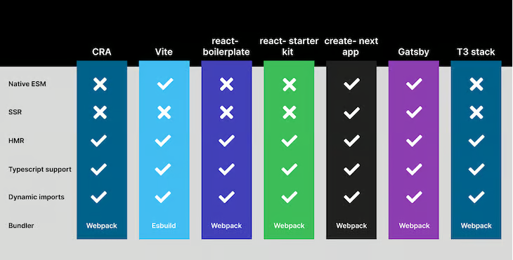
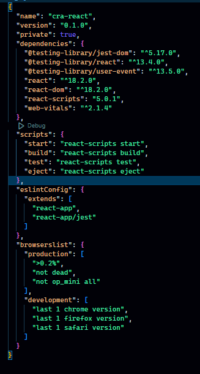
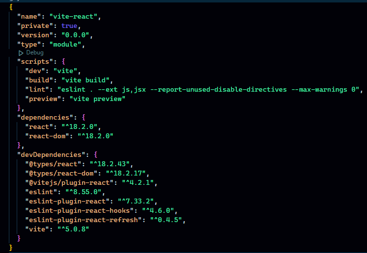

# Ways of creating react project
- Various ways but 2 of them are very popular
  1. using `create-react-app`
  2. using `vite`

## 1. create-react-app
- command: `npx create-react-app my-app`
- or if you are already in your project directory: `npx create-react-app .`

## 2. vite
- command: `npm create vite@latest my-app`
- or if you are already in your project directory: `npm create vite@latest .`

 (Source: The below blog)

- [https://blog.logrocket.com/vite-3-vs-create-react-app-comparison-migration-guide/](https://blog.logrocket.com/vite-3-vs-create-react-app-comparison-migration-guide/)
- [https://semaphoreci.com/blog/vite](https://semaphoreci.com/blog/vite)
- [[vite vs cra 2](https://makimo.com/blog/why-we-use-vite-instead-of-create-react-app/)](https://makimo.com/blog/why-we-use-vite-instead-of-create-react-app/)

## `package.json` of both compared

- ### cra package.json

- ### vite package.json

