- Javascript khud se html me inject ho kar manipulation nahi kar sakti, jab tak script tag ka use kar ke html me na include kare, js execute nahi hoga.
  

## create-react-app
- Create react app default directory structure

    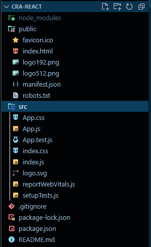

- In the `src` folder we can delete the following files: `App.test.js`, `logo.svg`, `reportWebVitals.js`, `setupTests.js` and the css files if you like.
- In the `public` folder we can delete the following files: `favicon.ico`, `logo192.png`, `logo512.png`, `manifest.json`,`robots.txt` to clean our project.
- Directory Structure after cleanup
  
  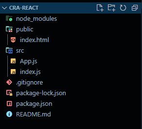
- In the `index.js` file, delete the following lines:
  
  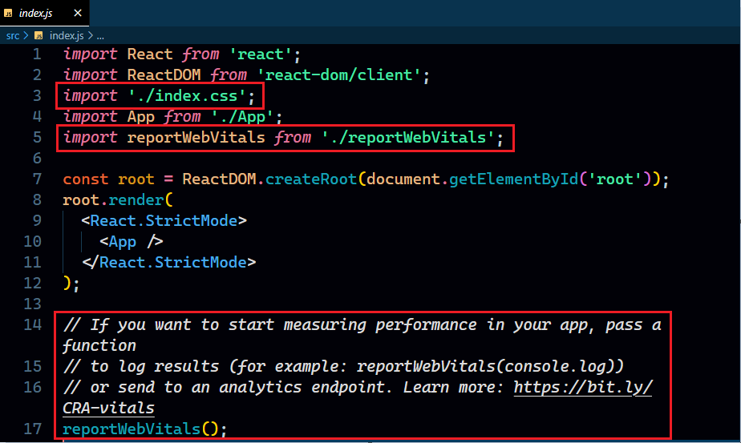

- In the `app.js` file, delete the following lines:
  
  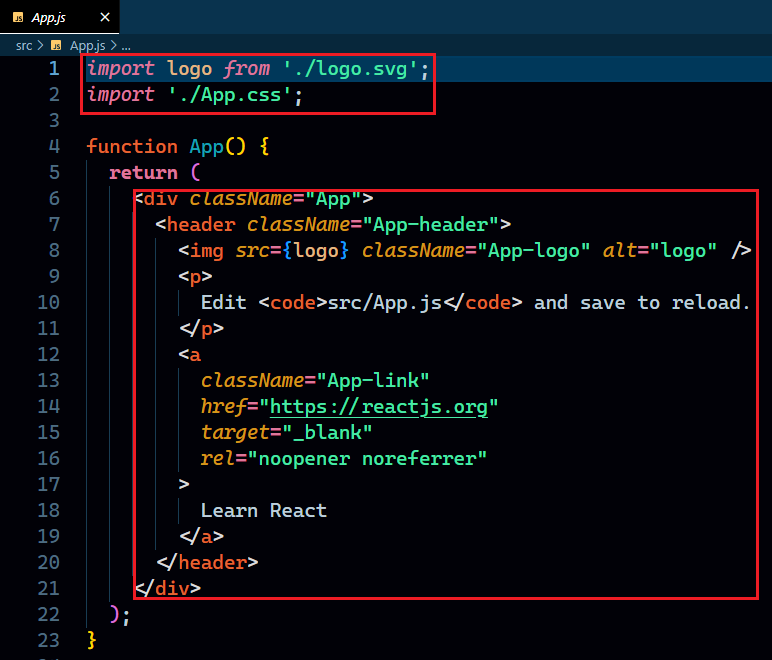

- Add a simple div in `app.js`
  
  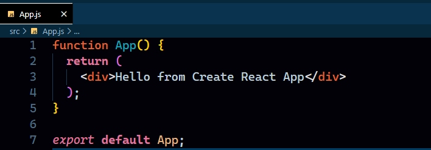

- Type `npm run start` in the terminal to run the app. The app should run without any error.
  
  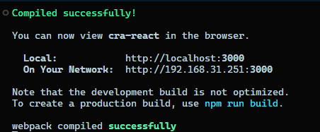

  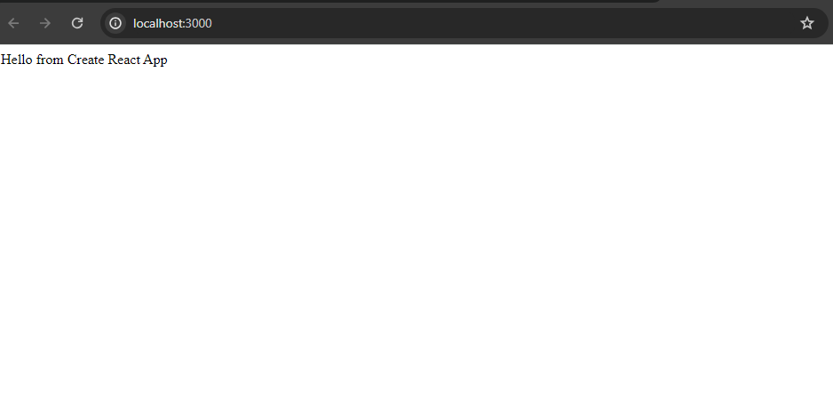

### Understanding flow CRA

-  If you see, in the `public` folder there is only one html page `index.html`. The content of this page after removing comments.
  
    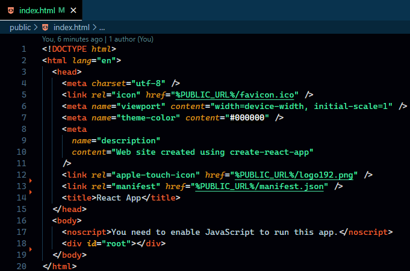

- A very important thing to see here: **There is no script tag that injects JS in out html**
- And now if we go to src folder and see the contents of index.js file.

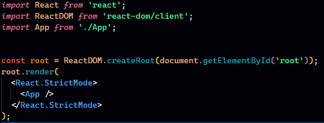

- Explaination
  
1. **Import Statements**:
  - React is imported from the 'react' library, which is necessary for creating React components.
  - ReactDOM is imported from 'react-dom/client'. This library provides methods for rendering React components in the DOM.

2. **App Component Import**:

   - The App component is imported from a file or module, presumably located at './App'. This is the main component that will be rendered in the application.

3. **ReactDOM.createRoot**:

    - ReactDOM.createRoot is used to create a root for the React application. This method is part of the Concurrent Mode API introduced in React 18. Concurrent Mode is an set of new features that help React apps stay responsive and gracefully adjust to the user's device capabilities and network speed.
      - The createRoot method is used to create a root in which React will perform concurrent rendering.

4. **Root Rendering**:

   - The root object, created using ReactDOM.createRoot, is used to render the App component.
   - Inside the root.render method, the App component is wrapped with <React.StrictMode>. This is a development mode feature that helps identify common issues in the application and provides warnings in the console for potential problems.

5. **Mounting Point**:

   - The document.getElementById('root') part is used to retrieve the HTML element with the ID 'root' from the DOM. This is the mounting point where the React application will be attached.

- But the point remains the same, how is this index.js file accessing element of index.html file even when the js file is not attached in html file using script tag.
- The answer to this is: 
  - CRA handles the bundling and injecting of scripts into the HTML file automatically during the build process. In a typical Create React App project, the public/index.html file is a template HTML file that serves as the entry point for your React application.
  - The index.js file, where we likely have our ReactDOM.createRoot logic, is automatically injected into the HTML file during the build. We don't manually include the index.js file in the HTML because CRA takes care of that for us.
  - The react-scripts is responsible for this.
  
  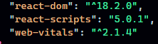

## vite

### Understanding flow VITE

- Vite default directory structure
  
  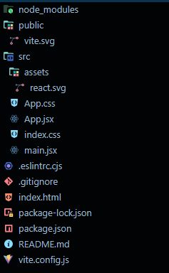

- As we can see, It is not that big as cra. As it doesn't include extra things such as testing files and packages, webvitals etc.
- To cleanup we can delete the svg files, and probably css files if we like.
- Here the entry point is `main.jsx` instead of index.js.
- `index.html`
  
  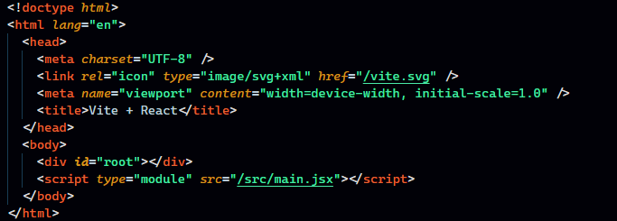

- The interesting thing is that here, the `main.jsx` is attached in the html file itself.

- `main.jsx` is more or less same.
  
  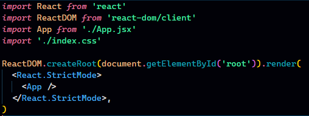

**Note**:
- In **vite** a component's name must be Capitalized and a proper component(that has JSX inside it) should have an extension `.jsx`. Otherwise it will give error.
- In **cra** have our proper component's extension as `.js` and it is completely fine. And we don't even need to give them Capitalized name, it does not throw any error, but might display a blank page.