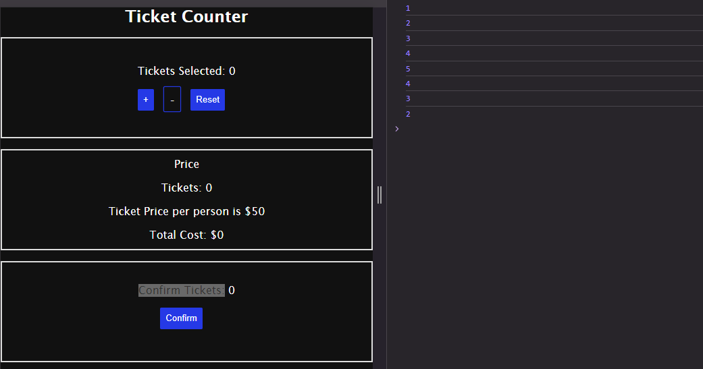

## UI ke andar kab kya cheez update hogi ye react decide karegi hum nahi. (React will decide when and what things will update inside the UI, we won't)
- In React, the framework takes care of efficiently updating the user interface (UI) in response to changes in the application's state. 
- React uses a virtual DOM (Document Object Model) to keep track of changes and updates the actual DOM only when necessary. 
- Developers generally declare how the UI should look based on the current state, and React determines the most efficient way to update the DOM to reflect those change
## React react karti hai variable ke updation par (React reacts to updates in variables)
-  React is designed to be reactive to changes in the application state. When the value of a variable (or state) used in a React component changes, React will automatically trigger a process called **reconciliation**.
-  During reconciliation, React will update the virtual DOM, compare it with the previous state, and then efficiently update only the parts of the actual DOM that have changed. This approach ensures that the UI remains in sync with the underlying data and minimizes unnecessary re-rendering for optimal performance.
  
## useState()
- useState allows functional components to have and manage state. When the state is updated, React takes care of efficiently propagating those changes to the UI/DOM, ensuring that the user interface is always in sync with the component's state.
> - ye hook hai state ko change karne ke liye responsible.
> - change ka matlab ye nahi ki value update kar di (value to normal variable me bhi update ho jaata hai), is change ko propagate kiya jaata hai humare UI/DOM ke andar.

## Example
- Suppose we have a situation like below
  
  

- In this situation we can see that, we have a counter "Tickets Selected" and a placeholder where number of tickets selected are shown. 
- Our job is when we click on "+" or "-" icon the values should get updated accordingly. And no of tickets selected is displayed in three components. So values should get updated accordingly.
- Let's try to do that.
- We can do it using classical JS by selecting each element and updating the value. Now suppose we have more components using the no of tickets value, then selecting each element then updating the value their becomes verbose.
- That's where React is very helpful.
- Let's try in react.
- Take a variable **noOfTickets** and increase it when **+** is clicked and decrease it when **-** is clicked.
- Code:
```
import './App.css';

function App() {
  let noOfTickets = 0;
  const addValue = () => {
    noOfTickets = noOfTickets + 1;
    console.log(noOfTickets);
  };
  const subtractValue = () => {
    noOfTickets = noOfTickets - 1;
    console.log(noOfTickets);
  };
  return (
    <>
      <h2>Ticket Counter</h2>

      <section className='counter'>
        <div className='tickets-selected'>
          Tickets Selected:{' '}
          <span className='ticket-counter-value'>{noOfTickets}</span>
        </div>
        <div>
          <button className='add-button' onClick={addValue}>
            +
          </button>
          <button className='remove-button' onClick={subtractValue}>
            -
          </button>
          <button className='reset-button'>Reset</button>
        </div>
      </section>

      <section className='price'>
        <div>Price</div>
        <p>
          Tickets: <span className='ticket-counter-value'>{noOfTickets}</span>
        </p>
        <p>Ticket Price per person is $50</p>
        <p>
          Total Cost: $<span className='total-cost'>0</span>
        </p>
      </section>

      <section className='confirm-tickets'>
        <div>
          Confirm Tickets:{' '}
          <span className='ticket-counter-value'>{noOfTickets}</span>
        </div>
        <button>Confirm</button>
        <p className='ticket-confirm-message'></p>
      </section>
    </>
  );
}

export default App;

```

- Output:



- As we can see, when we click + or -, the variable's value gets increased or decreased(see the console), but the value is not getting updated in the UI.
- That is happeing because this is just a normal variable and it can't be used to update the UI. 
- To update the UI React provides us states. We will use **useState()** hook to update the UI.

- Code using useState()

```
import { useState } from 'react';
import './App.css';

function App() {
  let [noOfTickets, setnoOfTickets] = useState(0);
  const addValue = () => {
    setnoOfTickets(noOfTickets + 1);
    console.log(noOfTickets);
  };
  const subtractValue = () => {
    setnoOfTickets(noOfTickets - 1);
    console.log(noOfTickets);
  };
  return (
    <>
      <h2>Ticket Counter</h2>

      <section className='counter'>
        <div className='tickets-selected'>
          Tickets Selected:{' '}
          <span className='ticket-counter-value'>{noOfTickets}</span>
        </div>
        <div>
          <button className='add-button' onClick={addValue}>
            +
          </button>
          <button className='remove-button' onClick={subtractValue}>
            -
          </button>
          <button className='reset-button'>Reset</button>
        </div>
      </section>

      <section className='price'>
        <div>Price</div>
        <p>
          Tickets: <span className='ticket-counter-value'>{noOfTickets}</span>
        </p>
        <p>Ticket Price per person is $50</p>
        <p>
          Total Cost: $<span className='total-cost'>0</span>
        </p>
      </section>

      <section className='confirm-tickets'>
        <div>
          Confirm Tickets:{' '}
          <span className='ticket-counter-value'>{noOfTickets}</span>
        </div>
        <button>Confirm</button>
        <p className='ticket-confirm-message'></p>
      </section>
    </>
  );
}

export default App;
``` 

- Output:


- Now we see that value is getting propagated and updated in UI

- [Read about useState() in documentation.](https://react.dev/reference/react/useState)

## Previous State

### Trying to update value of no of tickets more than once

```
import { useState } from 'react';
import './App.css';

function App() {
  let [noOfTickets, setnoOfTickets] = useState(0);
  const addValue = () => {
    setnoOfTickets(noOfTickets + 1);
    setnoOfTickets(noOfTickets + 1);
    setnoOfTickets(noOfTickets + 1);
    setnoOfTickets(noOfTickets + 1);
    setnoOfTickets(noOfTickets + 1);
    setnoOfTickets(noOfTickets + 1);
    console.log(noOfTickets);
  };
  const subtractValue = () => {
    setnoOfTickets(noOfTickets - 1);
    console.log(noOfTickets);
  };
  return (
    <>
      <h2>Ticket Counter</h2>

      <section className='counter'>
        <div className='tickets-selected'>
          Tickets Selected:{' '}
          <span className='ticket-counter-value'>{noOfTickets}</span>
        </div>
        <div>
          <button className='add-button' onClick={addValue}>
            +
          </button>
          <button className='remove-button' onClick={subtractValue}>
            -
          </button>
          <button className='reset-button'>Reset</button>
        </div>
      </section>

      <section className='price'>
        <div>Price</div>
        <p>
          Tickets: <span className='ticket-counter-value'>{noOfTickets}</span>
        </p>
        <p>Ticket Price per person is $50</p>
        <p>
          Total Cost: $<span className='total-cost'>0</span>
        </p>
      </section>

      <section className='confirm-tickets'>
        <div>
          Confirm Tickets:{' '}
          <span className='ticket-counter-value'>{noOfTickets}</span>
        </div>
        <button>Confirm</button>
        <p className='ticket-confirm-message'></p>
      </section>
    </>
  );
}

export default App;
```
- When we run this code, the noOfTickets get increased by only 1.
- When we call setnoOfTickets, React doesn't immediately update the state. Instead, it schedules an update and continues with the rest of the function. Therefore, calling setnoOfTickets multiple times in quick succession won't result in the state being incremented multiple times as you might expect.

- To fix this, we can use the functional form of setState, which allows you to update the state based on the previous state. Here's how we can modify your addValue function:

```
import { useState } from 'react';
import './App.css';

function App() {
  let [noOfTickets, setnoOfTickets] = useState(0);
  const addValue = () => {
    setnoOfTickets((prevCountOfTickets) => prevCountOfTickets + 1);
    setnoOfTickets((prevCountOfTickets) => prevCountOfTickets + 1);
    setnoOfTickets((prevCountOfTickets) => prevCountOfTickets + 1);
    setnoOfTickets((prevCountOfTickets) => prevCountOfTickets + 1);
    setnoOfTickets((prevCountOfTickets) => prevCountOfTickets + 1);
    console.log(noOfTickets);
  };
  const subtractValue = () => {
    setnoOfTickets(noOfTickets - 1);
    console.log(noOfTickets);
  };
  return (
    <>
      <h2>Ticket Counter</h2>

      <section className='counter'>
        <div className='tickets-selected'>
          Tickets Selected:{' '}
          <span className='ticket-counter-value'>{noOfTickets}</span>
        </div>
        <div>
          <button className='add-button' onClick={addValue}>
            +
          </button>
          <button className='remove-button' onClick={subtractValue}>
            -
          </button>
          <button className='reset-button'>Reset</button>
        </div>
      </section>

      <section className='price'>
        <div>Price</div>
        <p>
          Tickets: <span className='ticket-counter-value'>{noOfTickets}</span>
        </p>
        <p>Ticket Price per person is $50</p>
        <p>
          Total Cost: $<span className='total-cost'>0</span>
        </p>
      </section>

      <section className='confirm-tickets'>
        <div>
          Confirm Tickets:{' '}
          <span className='ticket-counter-value'>{noOfTickets}</span>
        </div>
        <button>Confirm</button>
        <p className='ticket-confirm-message'></p>
      </section>
    </>
  );
}

export default App;

```

- In React, the setState function can take either a new state value or a function that receives the previous state and returns the new state. When you call setnoOfTickets with a function as an argument, React guarantees that it will use the most recent state value at the time of execution.
- In each call to setnoOfTickets, we're using the functional form of setState and providing a function that takes the previous state (prevCountOfTickets) and increments it by 1. This ensures that each call to setnoOfTickets is based on the most recent state value, preventing the issue of the state not updating as expected.
Here's the sequence of events:
1. setnoOfTickets is called with the first function, which increments the state by 1.
2. Before the next setnoOfTickets call, React updates the state and re-renders the component.
3. Each subsequent call to setnoOfTickets now operates on the most recent state value, ensuring that the state is incremented correctly.


