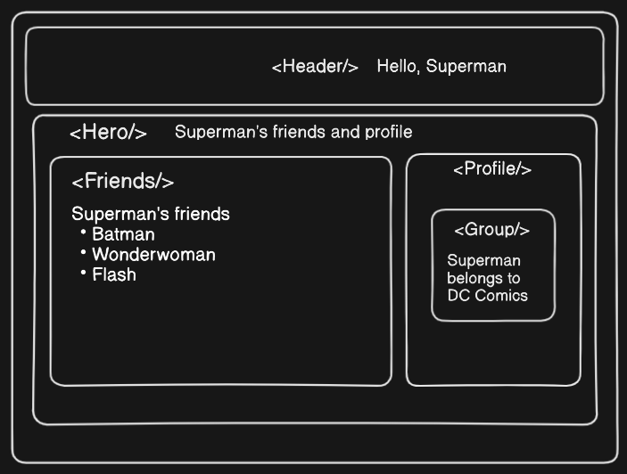

## Context / Passing data deeply with context

### The Problem - Prop Drilling

- Usually, we will pass information from a parent component to a child component via props.
- But passing props can become verbose and inconvenient if we have to pass them through many components in the middle, or if many components in our app need the same information.
- **CONTEXT** lets the parent component make some information available to any component in the tree below it - no matter how deep without passing it explicitly through props.

- Problem with passing props - **PROP DRILLING**
- The nearest common ancestor could be far removed from the components that need data, and lifting state up that high can lead to a situation called PROP DRILLING.

- Consider the following situation:



- We have mulitple components, A `<Header/>` component then its sibling `<Hero/>` component. Inside this we have two more comonents: `<Friends/>` and `<Profile/>` and Inside `<Profile/>` there is `<Group/>` component.
- And as we can see, the word "Superman" appears at multiple place. It is present in `Header`, `Hero`, `Friends` and `Group` components.
- Let's suppose "Superman" is the username. Then how would we pass this to the required components.
- In this case we will have username in our `<App/>` component, from there, we will pass it to `<Header/>` and `<Hero/>` component and from `<Hero/>` we will pass it to `<Friends/>` and `<Profile>`. Althought the `<Profile/>` component doesn't use this value, But to get the username to the `<Group/>` component, we need to send username through `<Profile/>` to `<Group/>`

- This is what is known as **Prop Drilling** as defined above.

- To solve this issue **Context** is used.

### Using Context to solve prop drilling

- There are three steps involved in context api
  1. Create the context
  2. Provide the context
  3. Use the context

### Solving the username prop drilling problem using Context - 1st way

- `UserContext.js`

```
import { createContext } from 'react';
const UserContext = createContext();
export default UserContext;
```

- `UserContextProvider.jsx`

```
import { useState } from 'react';
import UserContext from './UserContext';

const UserContextProvider = ({ children }) => {
  const [user, setUser] = useState('');
  return (
    <UserContext.Provider value={{ user, setUser }}>
      {children}
    </UserContext.Provider>
  );
};

export { UserContextProvider };
```

- `App.jsx`

```
import './App.css';
import { UserContextProvider } from './context/UserContextProvider';
import HeroInput from './components/HeroInput';
import UserContent from './components/UserContent';

function App() {
  return (
    <>
      <UserContextProvider>
        <HeroInput />
        <UserContent />
      </UserContextProvider>
    </>
  );
}

export default App;
```

- `HeroInput.jsx`

```
import React, { useContext } from 'react';
import UserContext from '../context/UserContext';

const HeroInput = () => {
  const { setUser } = useContext(UserContext);
  const handleChange = (e) => {
    setUser(e.target.value);
  };
  return (
    <>
      <div className='hero-input flex justify-center flex-wrap items-center gap-6 py-4'>
        <h2 className='bg-rose-700 px-3 py-2 rounded-lg'>Choose your hero</h2>
        <div className='flex gap-3'>
          <input
            type='radio'
            name='hero'
            id='superman'
            value='Superman'
            onChange={handleChange}
            className='accent-rose-600'
          />
          <label htmlFor='superman'>Superman</label>
          <input
            type='radio'
            name='hero'
            id='batman'
            value='Batman'
            onChange={handleChange}
            className='accent-rose-600'
          />
          <label htmlFor='batman'>Batman</label>
          <input
            type='radio'
            name='hero'
            id='wonderwoman'
            value='Wonderwoman'
            onChange={handleChange}
            className='accent-rose-600'
          />
          <label htmlFor='wonderwoman'>Wonderwoman</label>
        </div>
      </div>
    </>
  );
};

export default HeroInput;
```

- `UserContent.jsx`

```
import React from 'react';
import Header from './Header';
import Hero from './Hero';
import { useContext } from 'react';
import UserContext from '../context/UserContext';

const UserContent = () => {
  const { user } = useContext(UserContext);
  return (
    <>
      {user === '' ? null : (
        <>
          <Header /> <Hero />
        </>
      )}
    </>
  );
};

export default UserContent;
```

- `Header.jsx`

```
import UserContext from '../context/UserContext';
import { useContext } from 'react';
const Header = () => {
  const { user } = useContext(UserContext);
  return (
    <>
      <header className='text-2xl font-bold text-center bg-slate-800 p-4 mb-2'>
        <h2>
          Hello, <span className='italic font-mono'>{user}</span>
        </h2>
      </header>
    </>
  );
};
export default Header;
```

- `Hero.jsx`

```
import { useContext } from 'react';
import Friends from './Friends';
import Profile from './Profile';
import UserContext from '../context/UserContext';

const Hero = () => {
  const { user } = useContext(UserContext);
  return (
    <>
      <section className='hero mb-2'>
        <h2 className='text-center text-2xl font-semibold mb-2'>
          <span className='font-semibold italic font-mono'>{user}'s</span>{' '}
          friends and profile
        </h2>
        <div className='friends-profile grid sm:grid-cols-2 grid-cols-1 gap-4'>
          <Friends />
          <Profile />
        </div>
      </section>
    </>
  );
};
export default Hero;
```

- And similarly we can do this in any component.

### Solving the username prop drilling problem using Context - 2nd way

- `UserContext.js`
```
import { createContext, useContext } from 'react';

export const UserContext = createContext({
  user: '',
  setUser: () => {},
});

export const UserContextProvider = UserContext.Provider;

export default function useUser() {
  return useContext(UserContext);
}
```

- `App.jsx`
```
import './App.css';
import { UserContextProvider } from './context/UserContext';
import HeroInput from './components/HeroInput';
import UserContent from './components/UserContent';
import { useEffect, useState } from 'react';

function App() {
  const [user, setUser] = useState('');
  return (
    <>
      <UserContextProvider value={{ user, setUser }}>
        <HeroInput />
        <UserContent />
      </UserContextProvider>
    </>
  );
}

export default App;
```

- `HeroInput.jsx`
```
import React from 'react';
import useUser from '../context/UserContext';

const HeroInput = () => {
  const { setUser } = useUser();
  const handleChange = (e) => {
    setUser(e.target.value);
  };

  return (
    <>
      <div className='flex flex-wrap items-center justify-center gap-6 py-4 hero-input'>
        <h2 className='px-3 py-2 font-semibold text-white rounded-lg bg-rose-700'>
          Choose your hero
        </h2>
        <div className='flex gap-3'>
          <input
            type='radio'
            name='hero'
            id='superman'
            value='Superman'
            onChange={handleChange}
            className='accent-rose-600'
          />
          <label htmlFor='superman'>Superman</label>
          <input
            type='radio'
            name='hero'
            id='batman'
            value='Batman'
            onChange={handleChange}
            className='accent-rose-600'
          />
          <label htmlFor='batman'>Batman</label>
          <input
            type='radio'
            name='hero'
            id='wonderwoman'
            value='Wonderwoman'
            onChange={handleChange}
            className='accent-rose-600'
          />
          <label htmlFor='wonderwoman'>Wonderwoman</label>
        </div>
      </div>
    </>
  );
};

export default HeroInput;
```
- `UserContent.jsx`
```
import React from 'react';
import Header from './Header';
import Hero from './Hero';
import useUser from '../context/UserContext';

const UserContent = () => {
  const { user } = useUser();
  return (
    <>
      {user === '' ? null : (
        <>
          <Header /> <Hero />
        </>
      )}
    </>
  );
};

export default UserContent;
```

- `Header.jsx`
```
import useUser from '../context/UserContext';

const Header = () => {
  const { user } = useUser();
  return (
    <>
      <header className='p-4 mb-2 text-2xl font-bold text-center dark:bg-slate-800 bg-slate-200'>
        <h2>
          Hello, <span className='font-mono italic'>{user}</span>
        </h2>
      </header>
    </>
  );
};
export default Header;
```

- `Hero.jsx`
```
import Friends from './Friends';
import Profile from './Profile';
import useUser from '../context/UserContext';

const Hero = () => {
  const { user } = useUser();
  return (
    <>
      <section className='mb-2 hero'>
        <h2 className='mb-2 text-2xl font-semibold text-center'>
          <span className='font-mono italic font-semibold'>{user}'s</span>{' '}
          friends and profile
        </h2>
        <div className='grid grid-cols-1 gap-4 friends-profile sm:grid-cols-2'>
          <Friends />
          <Profile />
        </div>
      </section>
    </>
  );
};
export default Hero;
```
- And similarly we can do this in any component.

### Advantages of 2nd way over 1st way
1. **Abstraction and Encapsulation**:
   - The second approach abstracts the logic of accessing the user context into a custom hook (useUser). This encapsulation hides the implementation details of how the context is used, providing a cleaner and more modular code structure.
  - Custom hooks promote code reuse and maintainability, as the logic for accessing context is centralized in one place.
  
2. **Simplified Component Code**:
   - Components using the useUser hook in the second approach are cleaner and more concise. They only need to invoke the hook to get the relevant user context, making the code more readable.
   - In the first approach, components directly use the useContext function and consume the context, which can lead to duplicated code and less readable components.
  
3. **Better Separation of Concerns**:
   - In the second approach, the context-related logic is separated into the useUser hook, promoting a clearer separation of concerns. Components focus on rendering UI and functionality, while the hook handles the context interactions.
   - This separation enhances the maintainability of the codebase, as changes to the context or its usage can be localized to the custom hook.

4. **Ease of Testing**:
   - Custom hooks are easier to test in isolation. Testing the useUser hook allows for comprehensive testing of the context-related logic without the need to mount entire components.
   - In the first approach, testing the context usage within components may require more complex testing setups, potentially involving rendering components in test environments.

5. **Improved Consistency**:
   - By using the useUser hook consistently across components, the second approach promotes a more consistent and standardized approach to accessing the user context.
   - In the first approach, components may use useContext individually, leading to variations in how context is consumed throughout the codebase.

In summary, the second approach offers advantages in terms of abstraction, code organization, and maintainability by encapsulating context-related logic within a custom hook. This promotes cleaner, more modular components and facilitates easier testing of the context-related functionality.


### Theme Switcher and Multiple Contexts

- `UserContext.js`
```
import { createContext, useContext } from 'react';

export const UserContext = createContext({
  user: '',
  setUser: () => {},
});

export const UserContextProvider = UserContext.Provider;

export default function useUser() {
  return useContext(UserContext);
}
```

- `ThemeContext.js`
```
import { createContext, useContext } from 'react';

export const ThemeContext = createContext({
  themeMode: 'light',
  darkTheme: () => {},
  lightTheme: () => {},
});

export const ThemeContextProvider = ThemeContext.Provider;

export default function useTheme() {
  return useContext(ThemeContext);
}
```

- `App.jsx`
```
import './App.css';
import { UserContextProvider } from './context/UserContext';
import HeroInput from './components/HeroInput';
import UserContent from './components/UserContent';
import { ThemeContextProvider } from './context/ThemeContext';
import { useEffect, useState } from 'react';

function App() {
  const [themeMode, setThemeMode] = useState('light');
  const lightTheme = () => {
    setThemeMode('light');
  };
  const darkTheme = () => {
    setThemeMode('dark');
  };

  const [user, setUser] = useState('');
  //actual change in theme
  useEffect(() => {
    document.querySelector('html').classList.remove('light', 'dark');
    document.querySelector('html').classList.add(themeMode);
  }, [themeMode]);
  return (
    <>
      <ThemeContextProvider value={{ themeMode, lightTheme, darkTheme }}>
        <UserContextProvider value={{ user, setUser }}>
          <HeroInput />
          <UserContent />
        </UserContextProvider>
      </ThemeContextProvider>
    </>
  );
}

export default App;
```

- `HeroInput.jsx`
```
import React, { useContext } from 'react';
import useUser from '../context/UserContext';
import useTheme from '../context/ThemeContext';

const HeroInput = () => {
  const { setUser } = useUser();
  const handleChange = (e) => {
    setUser(e.target.value);
  };
  const { themeMode, lightTheme, darkTheme } = useTheme();
  const onChangeBtn = (e) => {
    const darkModeStatus = e.currentTarget.checked;
    if (darkModeStatus) {
      darkTheme();
    } else {
      lightTheme();
    }
  };

  return (
    <>
      <div className='flex flex-wrap items-center justify-center gap-6 py-4 hero-input'>
        <h2 className='px-3 py-2 font-semibold text-white rounded-lg bg-rose-700'>
          Choose your hero
        </h2>
        <div className='flex gap-3'>
          <input
            type='radio'
            name='hero'
            id='superman'
            value='Superman'
            onChange={handleChange}
            className='accent-rose-600'
          />
          <label htmlFor='superman'>Superman</label>
          <input
            type='radio'
            name='hero'
            id='batman'
            value='Batman'
            onChange={handleChange}
            className='accent-rose-600'
          />
          <label htmlFor='batman'>Batman</label>
          <input
            type='radio'
            name='hero'
            id='wonderwoman'
            value='Wonderwoman'
            onChange={handleChange}
            className='accent-rose-600'
          />
          <label htmlFor='wonderwoman'>Wonderwoman</label>
        </div>
        <div>
          <input
            type='checkbox'
            onChange={onChangeBtn}
            checked={themeMode === 'dark'}
          />
        </div>
      </div>
    </>
  );
};

export default HeroInput;
```

- `UserContent.jsx`
```
import React from 'react';
import Header from './Header';
import Hero from './Hero';
import useUser from '../context/UserContext';

const UserContent = () => {
  const { user } = useUser();
  return (
    <>
      {user === '' ? null : (
        <>
          <Header /> <Hero />
        </>
      )}
    </>
  );
};

export default UserContent;
```

- `Header.jsx`
```
import useUser from '../context/UserContext';

const Header = () => {
  const { user } = useUser();
  return (
    <>
      <header className='p-4 mb-2 text-2xl font-bold text-center dark:bg-slate-800 bg-slate-200'>
        <h2>
          Hello, <span className='font-mono italic'>{user}</span>
        </h2>
      </header>
    </>
  );
};
export default Header;
```

- `Hero.jsx`
```
import Friends from './Friends';
import Profile from './Profile';
import useUser from '../context/UserContext';

const Hero = () => {
  const { user } = useUser();
  return (
    <>
      <section className='mb-2 hero'>
        <h2 className='mb-2 text-2xl font-semibold text-center'>
          <span className='font-mono italic font-semibold'>{user}'s</span>{' '}
          friends and profile
        </h2>
        <div className='grid grid-cols-1 gap-4 friends-profile sm:grid-cols-2'>
          <Friends />
          <Profile />
        </div>
      </section>
    </>
  );
};
export default Hero;
```

And similarly we can do this in any component.